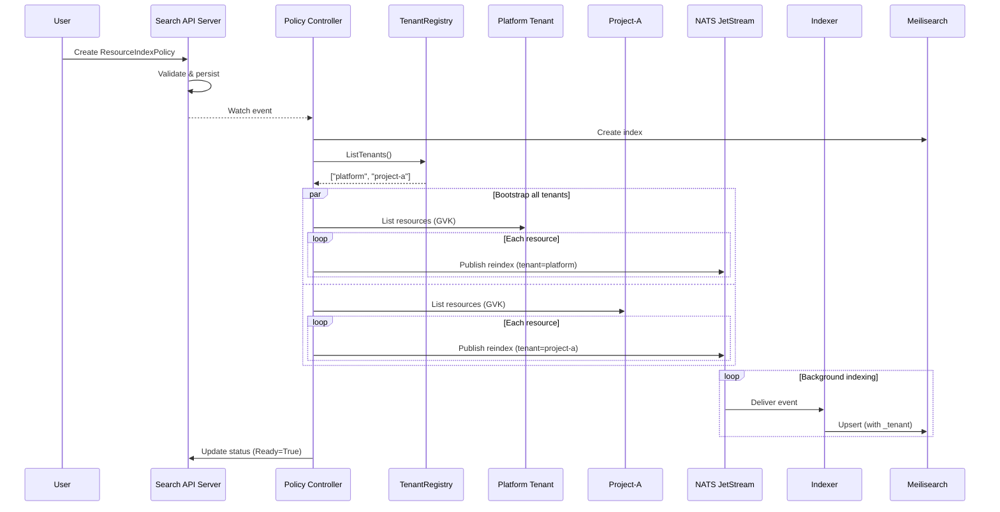
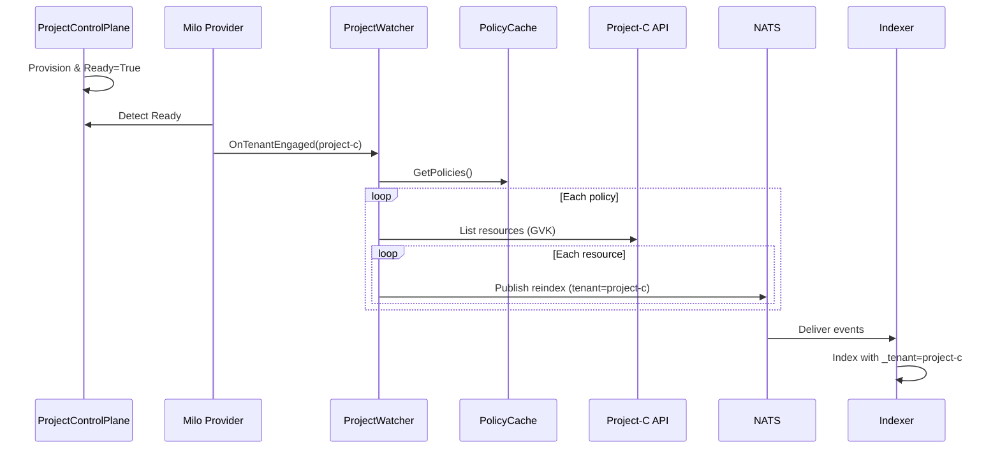
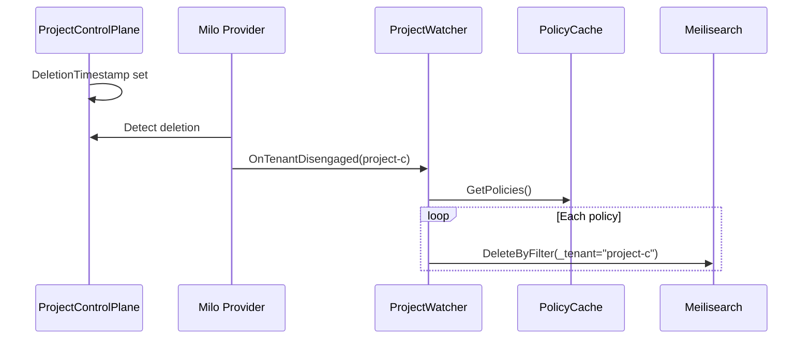

# Multi-Tenant Search Integration

## Overview

This design extends the Search service to operate across Milo's virtualized project control planes, enabling search capabilities for resources distributed across multiple tenants (platform and project control planes). The Search service will leverage Milo's multi-cluster runtime provider pattern to discover and index resources from all active project control planes while maintaining centralized search capabilities through the platform cluster.

**Key Principles**:
- Search remains a platform cluster service. Project control planes are data sources, not independent search deployments.
- **Multi-tenant is a deployment mode, not a per-policy option.** When enabled, all policies automatically index from all tenants (platform + projects).
- Policies define *what* to index; deployment configuration determines *where* to look.

## Requirements

### Functional Requirements

- FR1: Search service must discover and watch resources across all project control planes when deployed in multi-tenant mode
- FR2: ResourceIndexPolicy must trigger bootstrapping of resources from all active tenants (platform + projects)
- FR3: Audit events from project control planes must be aggregated into centralized NATS for indexing
- FR4: New project control planes coming online must trigger re-indexing for all applicable policies
- FR5: Project control plane deletion must clean up indexed resources from that tenant
- FR6: Documents must include tenant metadata to distinguish identical resources across control planes
- FR7: Search results must return tenant information (name and type) for each result

### Non-Functional Requirements

- NFR1: Horizontal scalability - multiple indexer instances process events concurrently
- NFR2: At-least-once indexing guarantees via NATS acknowledgment
- NFR3: Eventual consistency - resources indexed within seconds of creation
- NFR4: Graceful handling of project control plane unavailability
- NFR5: Single-tenant deployments continue working unchanged (no multi-tenant overhead)

## Design

### Architecture Overview

```
┌─────────────────────────────────────────────────────────────────────┐
│                        Platform Cluster                              │
│                                                                      │
│  ┌────────────────┐      ┌──────────────────┐                       │
│  │ Search API     │      │ Controller       │                       │
│  │ Server         │◄─────┤ Manager          │                       │
│  │ (aggregated)   │      │ - Policy Ctrl    │                       │
│  │                │      │ - Re-index Publ  │                       │
│  └────────┬───────┘      └────────┬─────────┘                       │
│           │                       │                                  │
│           │                       │ (multi-tenant mode)              │
│           │                       ▼                                  │
│           │              ┌──────────────────┐                       │
│           │              │ Milo Provider    │                       │
│           │              │ (tenant          │                       │
│           │              │  discovery)      │                       │
│           │              └────────┬─────────┘                       │
│           │                       │                                  │
│  ┌────────▼───────────────────────▼─────────┐                       │
│  │     NATS JetStream                        │                       │
│  │  ┌──────────────┐  ┌──────────────┐      │                       │
│  │  │ audit-events │  │ reindex-     │      │                       │
│  │  │ stream       │  │ stream       │      │                       │
│  │  └──────────────┘  └──────────────┘      │                       │
│  └───────────┬────────────────┬─────────────┘                       │
│              │                │                                      │
│  ┌───────────▼────────────────▼─────────────┐                       │
│  │     Resource Indexer (N instances)       │                       │
│  │  - Audit Consumer                        │                       │
│  │  - Re-index Consumer                     │                       │
│  │  - Policy Cache                          │                       │
│  │  - Milo Provider (multi-tenant mode)     │                       │
│  └───────────┬──────────────────────────────┘                       │
│              │                                                       │
│  ┌───────────▼──────────────────────────────┐                       │
│  │       Meilisearch                         │                       │
│  │  (centralized search backend)             │                       │
│  └───────────────────────────────────────────┘                       │
└─────────────────────────────────────────────────────────────────────┘
              │                            │
              │ (multi-tenant mode)        │
┌─────────────▼──────────┐   ┌─────────────▼──────────┐
│  Project-A Control      │   │  Project-B Control     │
│  Plane                  │   │  Plane                 │
│  ┌───────────────────┐  │   │  ┌──────────────────┐ │
│  │ Audit Sink        │  │   │  │ Audit Sink       │ │
│  │ (forwards to NATS)│  │   │  │ (forwards to     │ │
│  └───────────────────┘  │   │  │  NATS)           │ │
│  ┌───────────────────┐  │   │  └──────────────────┘ │
│  │ Resources         │  │   │  ┌──────────────────┐ │
│  │ - Deployments     │  │   │  │ Resources        │ │
│  │ - Services        │  │   │  │ - Deployments    │ │
│  │ - Pods            │  │   │  │ - Services       │ │
│  └───────────────────┘  │   │  └──────────────────┘ │
└─────────────────────────┘   └─────────────────────────┘
```

### Deployment Modes

The search service operates in one of two deployment modes, controlled by configuration flags:

| Mode | Flag | Behavior |
|------|------|----------|
| **Single-Tenant** (default) | `--multi-tenant=false` | Indexes only from platform tenant. Current behavior preserved. |
| **Multi-Tenant** | `--multi-tenant=true` | Indexes from platform tenant AND all discovered project control planes. |

### Tenant Types

| Tenant Type | Value | Description |
|-------------|-------|-------------|
| Platform | `platform` | The root platform control plane |
| Project | `project` | Project-level control planes |

### API Changes

#### ResourceIndexPolicy (Unchanged)

No changes to the ResourceIndexPolicy API. Policies define *what* resources to index (GVK + CEL conditions + fields). The deployment mode determines *where* those resources are discovered.

#### ResourceSearchQuerySpec (Unchanged)

No changes to the ResourceSearchQuerySpec API. Tenant filtering may be added in a future iteration.

#### SearchResult (Extended)

New `tenant` field in search results to identify which tenant each result belongs to:

```yaml
apiVersion: search.miloapis.com/v1alpha1
kind: ResourceSearchQuery
metadata:
  name: search-deployments
spec:
  query: "nginx"
status:
  results:
    - resource:
        apiVersion: apps/v1
        kind: Deployment
        metadata:
          name: nginx-deployment
          namespace: default
          uid: "abc-123"
      relevanceScore: 0.95
      # NEW: Tenant information for this result
      tenant:
        name: "my-project"
        type: "project"
    - resource:
        apiVersion: apps/v1
        kind: Deployment
        metadata:
          name: nginx-platform
          namespace: system
          uid: "def-456"
      relevanceScore: 0.87
      tenant:
        name: "platform"
        type: "platform"
  continue: ""
```

### Storage Design

#### Meilisearch Index Strategy: Single Federated Index per Resource Type

Each ResourceIndexPolicy creates **one Meilisearch index** containing documents from all tenants (platform + projects in multi-tenant mode). Documents are distinguished by `_tenant` and `_tenant_type` fields.

**Rationale**:
- Simplifies search queries (single index query, tenant filtering can be added later)
- Reduces Meilisearch index management overhead
- Enables cross-project search capabilities
- Primary key is UID which is globally unique across tenants

**Index Naming Convention** (unchanged):
```
{group}_{version}_{kind}
Example: apps_v1_deployment
```

**Filterable Attributes** (extended):
```
- Standard: uid, name, namespace, labels.*, annotations.*
- Tenant: _tenant, _tenant_type  (NEW)
- Policy-defined: fields marked as searchable in FieldPolicy
```

### Multi-Tenant Runtime Integration

#### Milo Multi-Cluster Runtime Overview

Milo uses the [multicluster-runtime](https://github.com/kubernetes-sigs/multicluster-runtime) library to enable controllers to operate across multiple clusters. The library provides:

| Component | Purpose |
|-----------|---------|
| **Provider** | Discovers clusters dynamically by watching `ProjectControlPlane` resources |
| **mcmanager.Manager** | Orchestrates multi-cluster operations, wraps controller-runtime Manager |
| **Engage/Disengage** | Lifecycle callbacks when clusters come online or are removed |
| **mcbuilder** | Builder API for creating multi-cluster-aware controllers |

**How it works:**
1. Provider watches `ProjectControlPlane` resources for `Ready=True` condition
2. When a project becomes ready, Provider creates a `cluster.Cluster` with REST config
3. Provider calls `Manager.Engage()` to register the cluster
4. Manager broadcasts engagement to all registered controllers via their `Engage()` callback
5. Controllers receive a context tied to cluster lifecycle; cancellation signals disengagement

**Quota controller example pattern:**
```
mcbuilder.ControllerManagedBy(mgr).
  For(&ResourceRegistration{},
    WithEngageWithLocalCluster(true),
    WithEngageWithProviderClusters(true)).
  Complete(reconciler)
```

#### Why Search Does Not Use Multi-Cluster Runtime Directly

The Search service has a fundamentally different architecture than Milo's controllers:

| Aspect | Milo Controllers | Search Indexer |
|--------|------------------|----------------|
| **Model** | Watch-based reconciliation | Event-driven (NATS JetStream) |
| **Runtime** | Full controller-runtime Manager | Lightweight cache + consumer |
| **Trigger** | Resource watch events | Audit events via message queue |
| **Scaling** | Leader election per controller | Competing consumers (horizontal) |

**Constraints preventing direct use:**
- **Architecture mismatch**: Multi-cluster runtime requires watch-based reconcilers; Search processes audit events from NATS
- **Manager overhead**: Full controller-runtime Manager includes webhooks, health servers, metrics - unnecessary for indexer
- **Version gap**: Search uses controller-runtime v0.23.x; multi-cluster runtime requires v0.20.x

#### TenantRegistry: Lightweight Multi-Tenant Abstraction

Instead of using multi-cluster runtime directly, Search implements a **lightweight `TenantRegistry`** inspired by its patterns:

| Implementation | Behavior |
|----------------|----------|
| **SingleTenantRegistry** | Returns only `["platform"]`; uses local client |
| **MultiTenantRegistry** | Watches `ProjectControlPlane` resources; creates per-tenant clients |

The `MultiTenantRegistry` reuses Milo's **discovery pattern** (watching `ProjectControlPlane` resources) without importing the multi-cluster runtime library:

- Watches `ProjectControlPlane` resources via standard informer
- Maintains map of tenant name → dynamic client
- Provides callbacks: `OnTenantEngaged(name)`, `OnTenantDisengaged(name)`
- No controller-runtime Manager dependency

This approach gives Search the same tenant discovery capabilities while preserving its event-driven architecture.

#### Configuration

| Flag | Description |
|------|-------------|
| `--multi-tenant` | Enable multi-tenant mode (default: false) |
| `--project-label-selector` | Filter which projects to index (optional) |

### Event Processing Flow

#### Leveraging the Activity System

The existing Activity system already provides the infrastructure Search needs for multi-tenant audit event processing:

**What Activity provides:**
- **Scope annotations** added at request time by Milo's `AuditScopeAnnotationDecorator`
- **NATS JetStream** pipeline (`audit.k8s.activity` subject) for durable delivery
- **Vector webhook** that collects audit events from all control planes

**Scope annotations in audit events:**

| Annotation | Values | Description |
|------------|--------|-------------|
| `platform.miloapis.com/scope.type` | `global`, `organization`, `project`, `user` | Scope level |
| `platform.miloapis.com/scope.name` | Tenant identifier | Organization or project name |

**Mapping to Search tenant fields:**

| Activity Scope Type | Search `_tenant_type` | Search `_tenant` |
|---------------------|----------------------|------------------|
| `global` | `platform` | `"platform"` |
| `organization` | `organization` | Organization name |
| `project` | `project` | Project name |

Search consumes from the existing NATS stream and extracts tenant metadata from these annotations—no separate audit sink deployment required.

#### Document Transformation

All indexed documents include tenant metadata fields:

| Field | Description |
|-------|-------------|
| `_tenant` | Tenant name (`"platform"` or project name) |
| `_tenant_type` | Tenant type (`"platform"` or `"project"`) |

### Bootstrap and Re-indexing Flow

#### Policy Creation/Update

When a ResourceIndexPolicy is created or updated:

1. Controller calls `TenantRegistry.ListTenants()` to get all tenants
2. For each tenant, uses `TenantRegistry.GetTenantClient()` to get a dynamic client
3. Lists all resources matching the policy's target GVK from each tenant
4. Publishes re-index events to NATS with tenant metadata
5. Indexer processes events and upserts documents with `_tenant` fields

#### New Project Coming Online

When a new project control plane becomes ready:

1. Milo provider detects `ProjectControlPlane` with `Ready=True`
2. Engages the tenant with the multicluster manager
3. Calls `OnTenantEngaged(projectName)` callback
4. ProjectWatcher triggers re-indexing for all policies against the new tenant

#### Project Deletion

When a project control plane is deleted:

1. Milo provider detects deletion
2. Calls `OnTenantDisengaged(projectName)` callback
3. ProjectWatcher deletes all documents where `_tenant == projectName` from each index

### Security Considerations

#### Authorization Model

- ResourceIndexPolicy: Requires cluster-admin permissions (modifies indexing behavior globally)
- ResourceSearchQuery: Subject to RBAC for search API group
- Cross-project queries: Future capability requiring IAM integration

#### Data Isolation

- Project control planes cannot read search indexes directly (only platform cluster API server)
- Audit events contain full resource data - ensure NATS transport is secured (TLS)
- Meilisearch access restricted to indexer and API server components

### Platform Capability Integrations

| Capability | Integration Point | Details |
|------------|-------------------|---------|
| IAM | Future | Cross-project search requires ProtectedResource integration |
| Quota | N/A | Search does not consume quota (internal service) |
| Activity | Event emission | Policy changes, project engagement events |

## Implementation Plan

### Phase 1: Foundation

1. Add `_tenant` and `_tenant_type` fields to document transformation
2. Update Meilisearch index settings to make tenant fields filterable
3. Create `TenantRegistry` interface with `SingleTenantRegistry` implementation
4. Add `--multi-tenant` flag to controller manager and indexer (defaults to false)

### Phase 2: Multi-Tenant Runtime Integration

5. Integrate Milo provider for project control plane discovery
6. Implement `MultiTenantRegistry` using Milo provider
7. Update policy controller to enumerate resources from all tenants
8. Add `--project-label-selector` flag for filtering projects

### Phase 3: Project Lifecycle Handling

9. Implement `ProjectWatcher` for tenant engagement/disengagement
10. Implement re-indexing on tenant engagement
11. Implement document cleanup on tenant disengagement

### Phase 4: Event Processing

12. Update indexer consumer to extract scope annotations from audit events
13. Map Activity scope types to Search tenant types (`global` → `platform`, etc.)

### Phase 5: API Enhancements

14. Add `TenantInfo` to `SearchResult`
15. Update search strategy to populate tenant info in results
16. Update OpenAPI specifications

### Phase 6: Testing and Documentation

17. Unit tests for TenantRegistry implementations
18. Integration tests with mocked Milo provider
19. End-to-end tests with multiple project control planes
20. Documentation updates for deployment configuration

## Migration Path

### Backward Compatibility

**Existing single-tenant deployments continue unchanged.**

When `--multi-tenant=false` (default):
- All policies index from platform tenant only
- Documents have `_tenant="platform"`, `_tenant_type="platform"`
- No Milo provider integration
- No project lifecycle handling

### Enabling Multi-Tenant

To enable multi-tenant indexing:

1. Deploy audit sinks to project control planes
2. Update controller manager: add `--multi-tenant=true`
3. Update indexer: add `--multi-tenant=true`
4. Restart both components
5. Existing policies automatically begin indexing from project control planes
6. New project control planes are discovered automatically

## Sequence Diagrams

### Sequence 1: Policy Creation in Multi-Tenant Mode



### Sequence 2: New Project Coming Online



### Sequence 3: Project Deletion



## Decisions Made

| Decision | Rationale |
|----------|-----------|
| **Multi-tenant as deployment mode, not policy option** | Simplifies policy API; deployment determines scope; cleaner separation of concerns |
| **Single federated index per resource type** | Simplifies queries; enables cross-project search; UID is globally unique |
| **Lightweight TenantRegistry instead of multi-cluster runtime** | Search is event-driven (NATS); multi-cluster runtime requires watch-based reconcilers and full Manager overhead; version incompatibility with controller-runtime |
| **Reuse discovery pattern, not library** | Watch `ProjectControlPlane` resources like Milo does, but via standard informer without multi-cluster runtime dependency |
| **TenantRegistry abstraction** | Clean interface for single vs multi-tenant; easy to test; swap implementations |
| **Best-effort multi-tenant bootstrapping** | One failing tenant doesn't block others; eventual consistency acceptable |
| **Tenant metadata in all documents** | Enables filtering and cleanup; consistent even in single-tenant mode |
| **Tenant info in search results** | Each result includes tenant name and type for client-side filtering/display |
| **Leverage Activity system for audit events** | Activity already adds scope annotations and provides NATS pipeline; no separate audit sink deployment needed |

## Open Questions

| Question | Status | Recommendation |
|----------|--------|----------------|
| Tenant filtering in search queries | Future work | Add `tenantFilter` to ResourceSearchQuerySpec when needed |
| Cross-project search authorization | Future work | Defer until IAM ProtectedResource integration |
| Query performance with 100+ tenants | Test | Benchmark before production |

## Breaking Changes

None. All changes are backward compatible.
